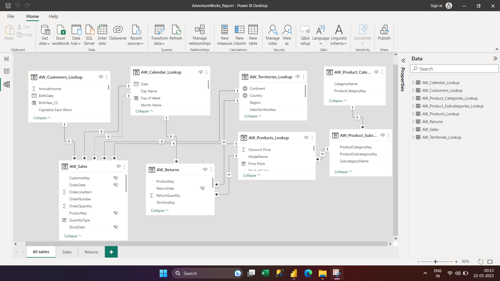
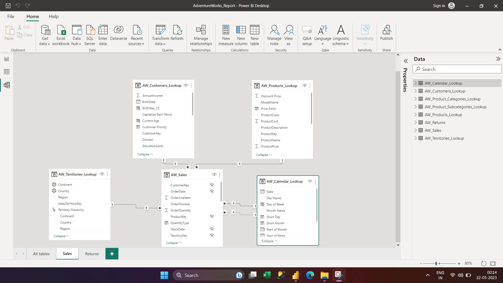
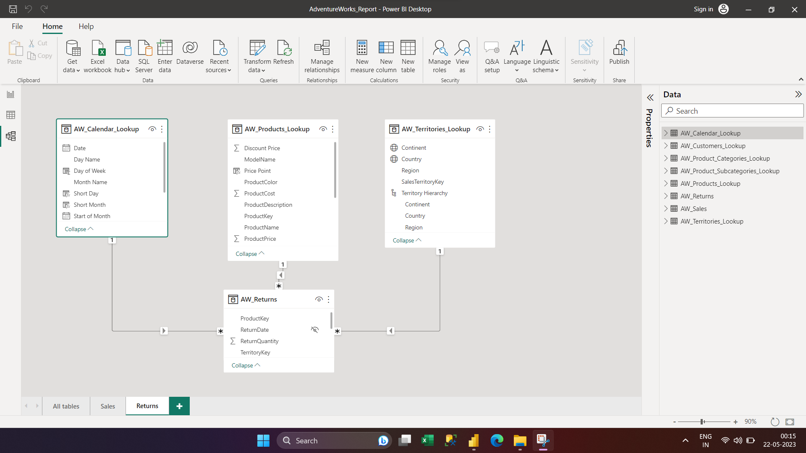
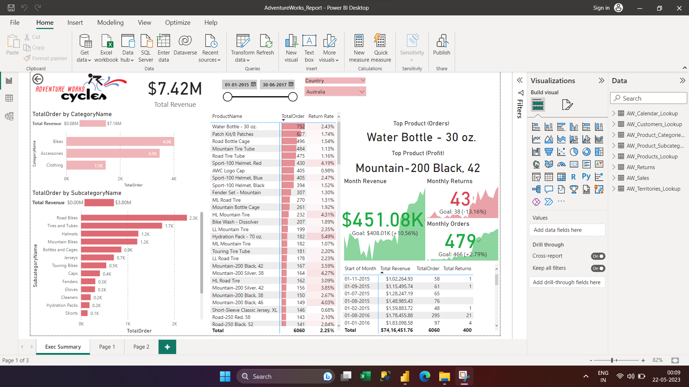
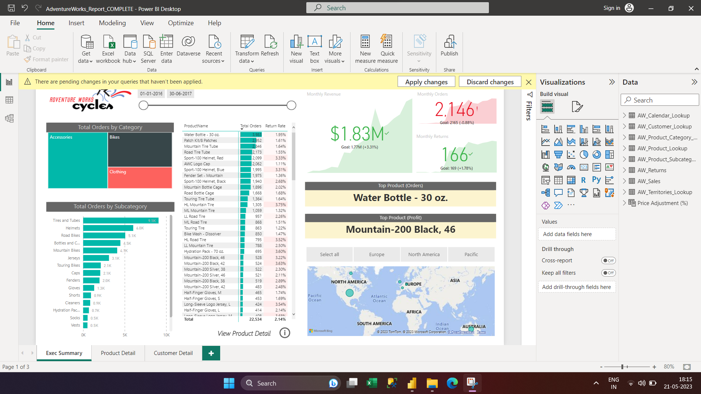
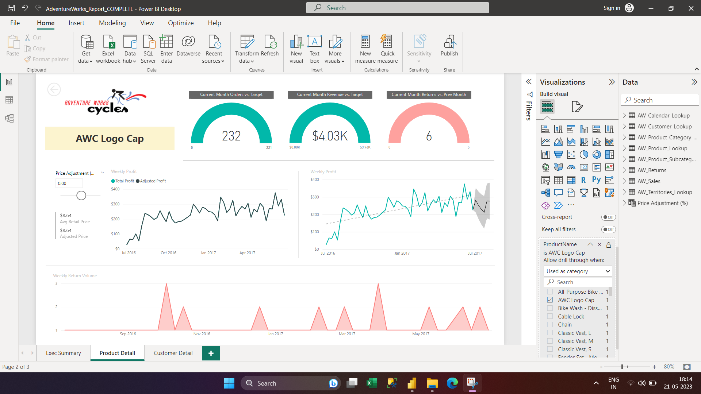
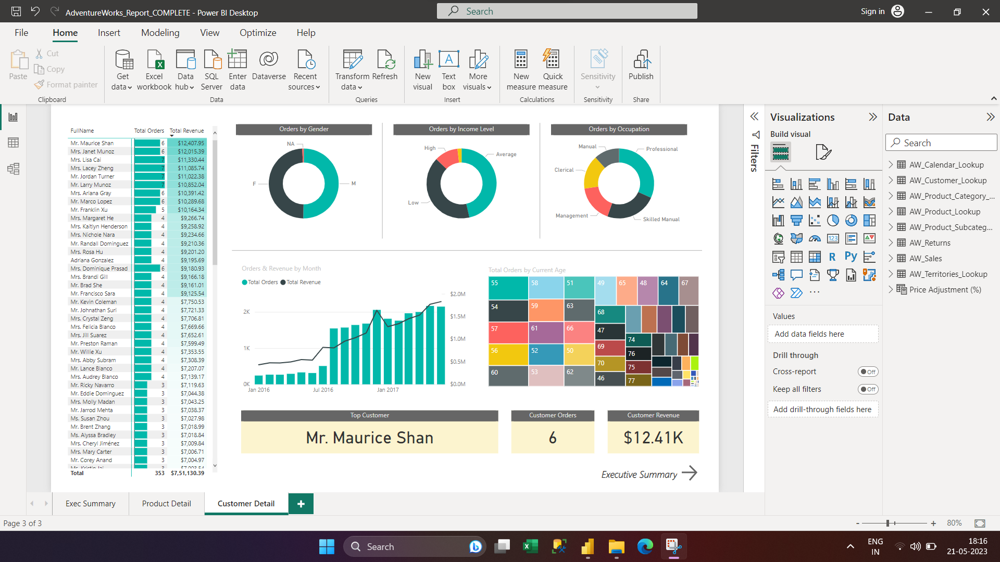
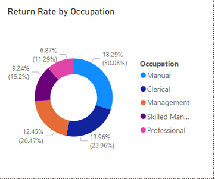
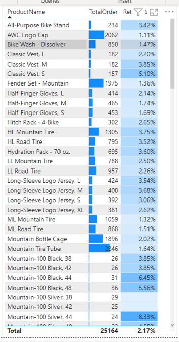
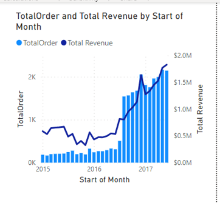

# ADVENTURE WORKS REPORT:
## Project Overview:
In this project, I'm playing the role of business intelligence analyst for Adventure Works Cycles, a global manufacturing company. My mission? To design and deliver a professional-quality, end-to-end business intelligence solution, armed only with Power BI and a handful of raw CSV files.
### Objectives:
###### •	Connect & Transform the Raw Data
###### •	Build a Relational Data Model
Data modeling for all tables

Data Modeling for sales tables

Data modeling for returned product

###### •	Add Calculated Field with DAX
###### •	Design Interactive Power BI Reports

###### •	Created data visualization tools to monitor execution summary, product details, customer details, identify trends and suggest improvement strategies.
###### execution summary

###### product details

###### customer details

###### •	Developed criteria to assist with sorting and filtering relevant data.

###### •	Consolidated data from multiple sources to provide a comprehensive view of sales performance.
###### •	Designed and built user-friendly dashboards with interactive features to glean actionable insights.
